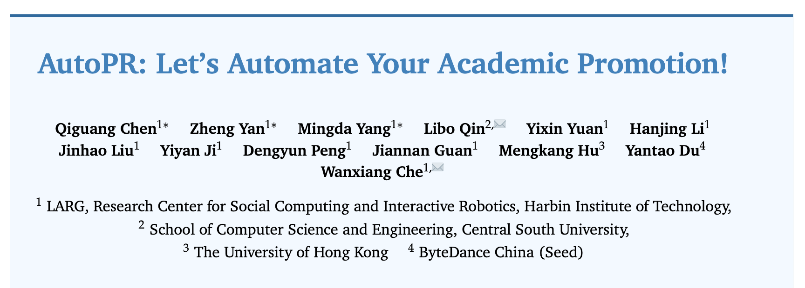
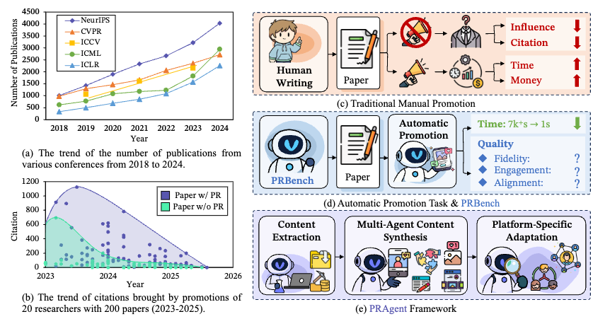
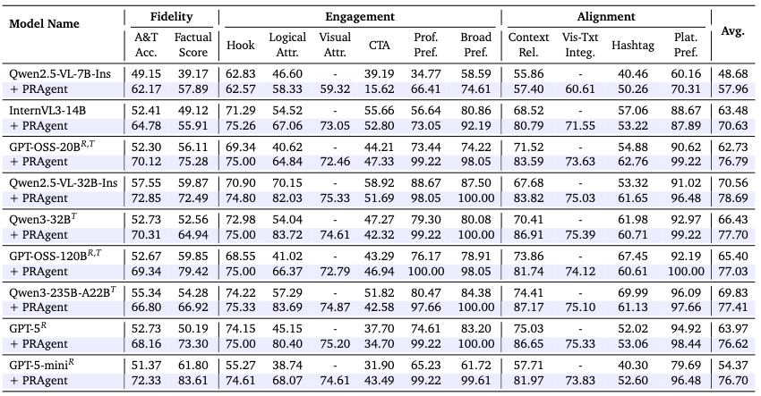
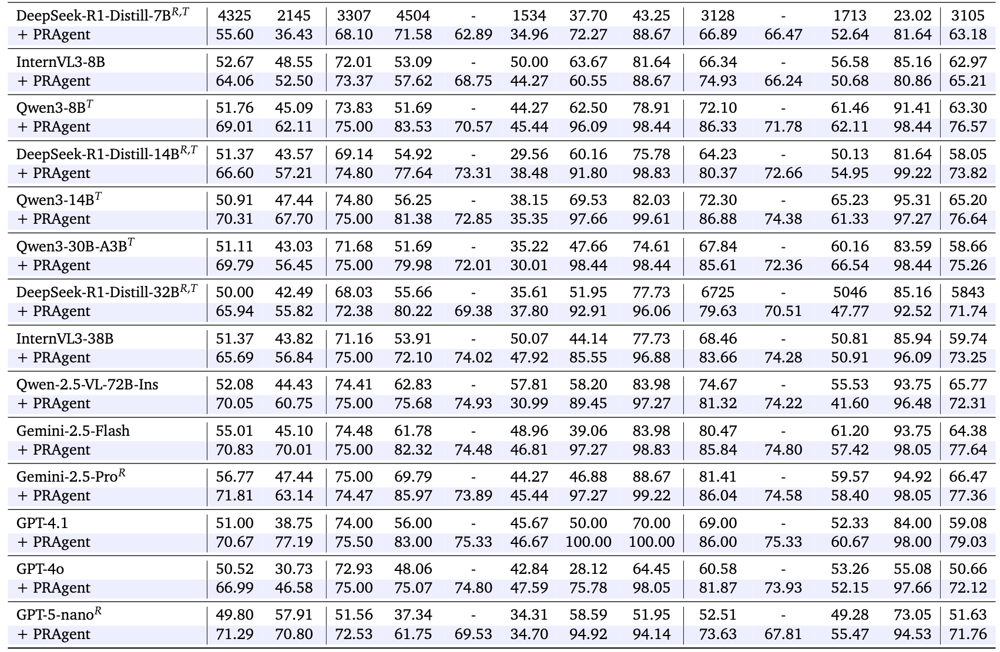
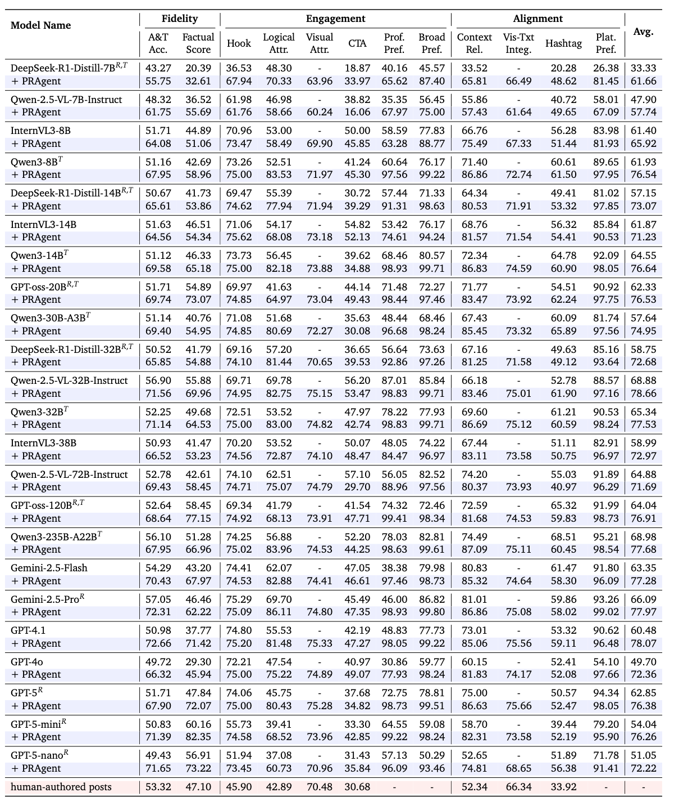

<p align="center">
<h1 align="center"> 🎉 AutoPR: Let's Automate Your Academic Promotion!</h1>
</p>
<p align="center">
  	<a href="https://github.com/LightChen233/AutoPR">
      
    </a>
    <a href="ttps://github.com/LightChen233/AutoPR">
       
  	</a>
   	<a href="https://github.com/LightChen233/AutoPR/stargazers">
       
  	</a>
  	<a href="https://github.com/LightChen233/AutoPR/network/members">
       
  	</a>
    <a href="https://github.com/LightChen233/AutoPR/issues">
      
    </a>
    <br />
    
</p>

<p align="center">
  	<b>
    | [<a href="https://arxiv.org/abs/2510.09558">📝 ArXiv</a>] | [<a href="https://yzweak.github.io/autopr.github.io/">📚 Project Website</a>] | [<a href="https://huggingface.co/datasets/yzweak/PRBench">🤗 PRBench</a>] | [<a href="https://huggingface.co/spaces/yzweak/AutoPR">🔥 PRAgent Demo</a>] |
    </b>
    <br />
</p>


This is the official implementation for **"AUTOPR: LET'S AUTOMATE YOUR ACADEMIC PROMOTION!**".



## 👀 1. Overview
As the volume of peer-reviewed research surges, scholars increasingly rely on social platforms for discovery, while authors invest significant effort in promotion to sustain visibility and citations. This project aims to address that challenge.

We formalize **AutoPR (Automatic Promotion)**, a new task to automatically translate research papers into faithful, engaging, and well-timed public-facing content. To accomplish this, we developed **PRAgent**, a modular agentic framework for automatically transforming research papers into promotional posts optimized for specific social media platforms.



-----

## 🔥 2. News
- **[2025-10-08]** Our 🔥🔥 **PRAgent** 🔥🔥 and 🔥🔥 **PRBench** 🔥🔥 benchmark is released! You can download the dataset from here.


-----

## 🏅 3. Leaderboard

### 3.1 PRBench-Core



### 3.2 PRBench-Full


-----

## 🛠️ 4. Installation & Configuration

### 4.1 Environment Installation

1.  Create and activate a Conda environment (recommended):

    ```bash
    conda create -n autopr python=3.11
    conda activate autopr
    ```

2.  Install the required dependencies:

    ```bash
    pip install -r requirements.txt
    ```


### 4.2 Configuration

Before running the code, you need to configure your Large Language Model (LLM) API keys and endpoints.

First, copy the example `.env.example` file to a new `.env` file:

```bash
cp .env.example .env
```

Then, edit the `.env` file with your API credentials:

```python
# Main API Base URL for text and vision models (e.g., OpenAI, Qwen, etc.)
OPENAI_API_BASE="https://api.openai.com/v1"
# Your API Key
OPENAI_API_KEY="sk-..."
```

The scripts will automatically load these environment variables.

-----

## ⚡ 5. PRBench Evaluation

The entire workflow, from generation to evaluation, is managed through simple shell scripts.

### 5.1 Step 1: Preparation

Download the PRBench dataset from Hugging Face Hub. You can choose to download the full dataset or the core subset.

```bash
python download_and_reconstruct_prbench.py \
    --repo-id yzweak/PRBench \
    --subset core \ # or "full"
    --output-dir eval
```

You also need to download the [DocLayout-YOLO](https://huggingface.co/juliozhao/DocLayout-YOLO-DocStructBench/blob/main/doclayout_yolo_docstructbench_imgsz1024.pt) model. You can specify the path to the model using the `--model-path` argument in the generation script.

### 5.2 Step 2: Evaluate Post Quality

After generation, use the evaluation script to assess the quality of the posts in your output directory.

```bash
chmod +x scripts/run_eval.sh
./scripts/run_eval.sh
```

### 5.3 Step 3: Calculate and View Metrics

Finally, run the calculation script to aggregate the raw evaluation data into a formatted results table.

```bash
chmod +x scripts/calc_results.sh
./scripts/calc_results.sh
```

## 🕹️ 6. End-to-end Article Generation

The pipeline generates one Chinese WeChat-style long-form article from a single paper PDF.

### 6.1 Run

```bash
python pragent/quality/generate_article.py <pdf> <out>
```

Optional flags:

| Flag | Meaning |
| --- | --- |
| `--model` | Model ID. Defaults to `AUTOPR_MODEL`, falling back to `gemini-3.7-flash`. |
| `--style <style.json>` | Inject a distilled writing style (output of `style_distill`). |
| `--ai-tone-threshold` | Risk-score threshold that triggers selective AI-tone rewriting. Default `35`. |
| `--skip-less-ai-tone` | Skip local-detector-driven selective AI-tone reduction. |
| `--visual-mode` | `original` (default, paper figures as-is) / `skill` / `legacy`. |
| `--skill-visual KEY=PATH` | Pre-built visual asset, e.g. `figure_5=C:/x/figure5.html`. Only used with `--visual-mode skill`. |
| `--flow-redraw NUM=PATH` | Redraw a flowchart, e.g. `4=C:/x/fig4.png`. |

### 6.2 Credentials

Two credential sources are resolved at runtime, in priority order:

1. `BAILIAN_KEY` (+ optional `BAILIAN_BASE`) from the environment.
2. Local Antigravity proxy config at `~/.antigravity_tools/gui_config.json`, exposing an
   OpenAI-compatible endpoint on `http://127.0.0.1:<port>/v1`.

No layout-detection model is required. Figures and tables are read directly from each rendered
page by a vision-language model (the previous YOLO-based cropping step has been removed, so
there is no `.pt` weight to download).

### 6.3 Pipeline Stages

Text extraction → figure extraction & classification → WeChat draft → citation weaving →
full-text fact conservation → local detector QA (×3) → selective AI-tone reduction → second
fact audit. Every numeric claim is bound to an exact PDF page, bounding box and `text_hash`
via the `research_brief` module.

Outputs land in `<out>/`: `paper.txt`, `draft.md`, `article_grounded.md`, `fact_audit.json`,
`ai_tone_before.json`, `ai_tone_after.json`, `less_ai_tone.json`,
`fact_audit_after_humanize.json`, `recon.json`, `article.md`.

## ☎️ Contact
If interested in our work, please contact us at:
- Qiguang Chen: charleschen2333@gmail.com
- Zheng Yan: zyan@ir.hit.edu.cn

## 🎁 Citation
```
@misc{chen2025autopr,
      title={AutoPR: Let's Automate Your Academic Promotion!}, 
      author={Qiguang Chen and Zheng Yan and Mingda Yang and Libo Qin and Yixin Yuan and Hanjing Li and Jinhao Liu and Yiyan Ji and Dengyun Peng and Jiannan Guan and Mengkang Hu and Yantao Du and Wanxiang Che},
      journal={arXiv preprint arXiv:2510.09558},
      year={2025},
}
```
