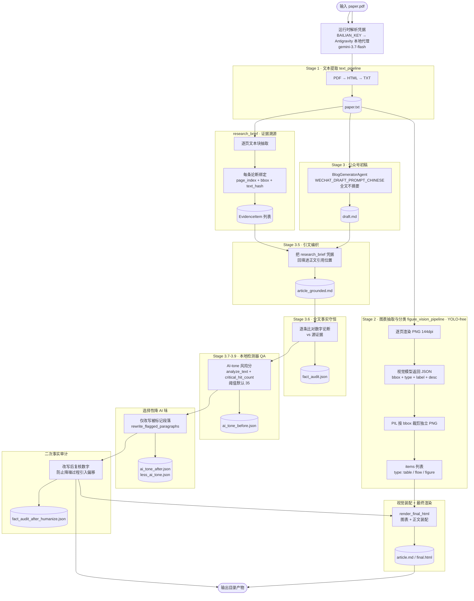

# AutoPR 工作流程图

> 入口：`python pragent/quality/generate_article.py <pdf> <out>`（单篇 PDF → 中文公众号长文）。
> 全程异步，9 个阶段串行推进，产物落在 `<out>/`。
> 删除前的旧多平台管线存档于 git tag `legacy-pipeline-final`。

## CLI 参数

| 参数 | 说明 |
|---|---|
| `--model` | 模型 ID。默认读 `AUTOPR_MODEL`，未设置则用 `gemini-3.7-flash` |
| `--style <style.json>` | 注入文风蒸馏产物（`style_distill` 输出） |
| `--ai-tone-threshold` | 触发选择性改写的 AI-tone 风险分阈值，默认 `35` |
| `--skip-less-ai-tone` | 跳过本地 Detector QA 驱动的降 AI 味阶段 |
| `--visual-mode` | `original`（默认，论文原图）/ `skill`（只接收原版 Skill 成品）/ `legacy` |
| `--skill-visual KEY=PATH` | 预生成视觉成品，如 `figure_5=C:/x/figure5.html`；仅 `skill` 模式使用 |
| `--flow-redraw NUM=PATH` | 流程图重绘，如 `4=C:/x/fig4.png` |

## 产物清单

| 文件 | 内容 |
|---|---|
| `paper.txt` | Stage 1 文本抽取结果 |
| `draft.md` | Stage 3 结构化初稿 |
| `article_grounded.md` | 引文编织后的 grounded 稿 |
| `fact_audit.json` | 首轮事实审计 |
| `ai_tone_before.json` | 降噪前 AI-tone 风险分 |
| `less_ai_tone.json` | 改写记录 |
| `ai_tone_after.json` | 降噪后风险分 |
| `fact_audit_after_humanize.json` | 二次事实审计 |
| `recon.json` | 视觉装配中间产物 |
| `article.md` | 最终成稿 |

## 关键设计

| 维度 | 说明 |
|---|---|
| 证据溯源 | `research_brief` 模块把每条论断绑定到原文 `page_index` + `bbox` + `text_hash`，`text_hash` 用于防篡改校验 |
| 全文不摘要 | Stage 3 直接喂全文。分层摘要有意关闭——静默截断会让后段章节、表格、limitations 和精确数字从证据基中消失 |
| 单一入口 | 无平台分支逻辑。已移除 Twitter / 小红书（xiaohongshu）适配 |
| 凭证解析 | 优先 `BAILIAN_KEY` + `BAILIAN_BASE`；缺失则回退 `~/.antigravity_tools/gui_config.json` 的本地代理 |
| 二次审计 | 降 AI 味改写后必须复核数字，避免改写过程引入事实漂移 |
