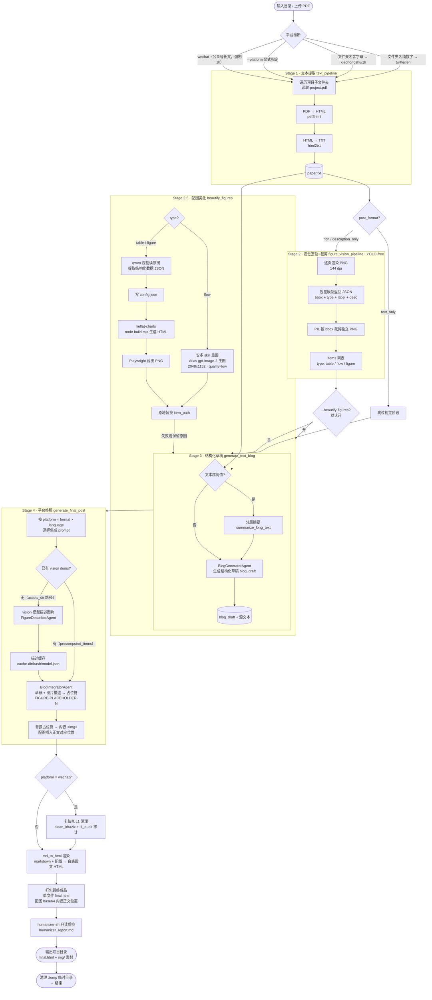

# AutoPR 工作流程图

> 入口：`run.py --input-dir <projects> --output-dir <out>`（CLI）或 `app.py`（Gradio 网页）。
> 每个项目子文件夹含一个 PDF，全流程异步，支持并发与断点续跑（输出目录已存在则跳过）。

## 关键分支与配置

| 维度 | 说明 |
|---|---|
| 平台推断 | 目录名纯数字→twitter/en；含字母→xiaohongshu/zh；`--platform` 可显式覆盖；wechat 强制中文长文路径 |
| 配图美化 | `--beautify-figures`（默认开）/ `--no-beautify-figures`；flow 图走 Atlas 生图，table/figure 走 lieflat-charts 重构；失败保留原图 |
| 后处理（wechat） | 卡兹克 L1 清理 + 违禁词审计 + 可选 humanizer-zh 只读质检（`--skip-humanizer-qc` 跳过） |
| 断点续跑 | 输出目录已存在且非空则跳过该项目 |
| 并发 | `--concurrency` 控制并行项目数，信号量限流 |
| 消融/基线 | `--ablation <mode>` / `--baseline-mode <mode>` 切换实验分支，输出带 `_ablation_*` / `_baseline_*` 后缀 |
| API | text/vision 默认共用 key（`--text-api-key` → `--vision-api-key` 回退），Base 默认 OpenAI；qwen3.8-max-preview 默认模型；Atlas 生图 key 走 `--atlas-key` 或 `ATLASCLOUD_API_KEY` |
